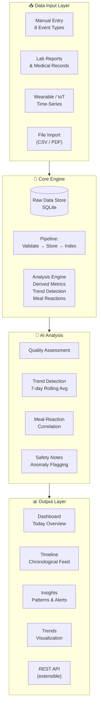
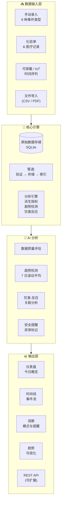

<p align="center">
  
</p>

<h1 align="center">Health OS<br><sub>Personal Health Memory System &amp; AI Analysis Layer</sub></h1>

<p align="center">
  
  
  
  
  
  
  
  
</p>

<br>

<!-- ==================== LANGUAGE TOGGLE ==================== -->

<details open>
<summary>🇬🇧 English</summary>

<br>

> **Health OS** is an AI-powered analysis layer for long-term personal health data — unifying vitals, lab reports, medical records, lifestyle habits, and time-series data into a searchable, inferrable, and persistently trackable **personal health memory system**.

## 🧠 Vision

<p align="center">
  <i>Your body generates data every second. Most of it is lost. <b>Health OS</b> keeps it, connects it, and helps you understand it.</i>
</p>

## 🏛 System Architecture



### Data Pipeline

```
  Raw Events          Validation           Derived Metrics         Insights
  ┌─────────┐     ┌──────────────┐     ┌────────────────┐     ┌──────────────┐
  │  Meal   │────>│              │     │ Skin Score     │     │ Data Quality │
  │  Sleep  │────>│  Zod Schema  │────>│ Stress Peak    │────>│ Trend Alerts │
  │  Bowel  │────>│  Type Safety │     │ Bloating Avg   │     │ Meal Rxns    │
  │  Water  │────>│              │     │ Bristol Median │     │ Safety Flags │
  │  ...    │────>│              │     │ Fiber Diversity│     │              │
  └─────────┘     └──────────────┘     └────────────────┘     └──────────────┘
```

## ✨ Features

### 📝 Multi-Source Data Capture

| Source | Input Method |
|--------|-------------|
| **Manual Entry** | 8 event types via PWA (15s per record) |
| **Lab Reports** | Structured data import (in progress) |
| **Wearables** | Time-series sync (planned) |
| **Medical Records** | Import & tagging (planned) |

#### Current Record Types

| Type | Fields |
|------|--------|
| **Meal** | Food items, cooking method, hunger/stress, processed food flags, additives, portion |
| **Supplement** | Name, brand, dose, with-meal flag |
| **Post-meal Symptom** | Bloating/pain/reflux/heaviness/gas (0-4) — linked to a meal |
| **Bowel** | Bristol type (1-7), strain (0-3), urgency, incomplete emptying, blood |
| **Water** | Volume (ml), drink type, optional urine color |
| **Nosebleed** | Side, amount, duration |
| **Daily Summary** | Skin scores, nasal blockage, stress peak, fiber diversity |
| **Sleep** | Duration, quality, awakenings, disruption |

All forms follow a **lazy-recording philosophy**: capture the core signal first, details are optional.

### 📊 Data Consumption

- **Dashboard** — At-a-glance daily status
- **Timeline** — Searchable, paginated event history with edit/delete
- **Insights** — Computed patterns, correlations, and alerts
- **Trends** — 6-metric visualization with 14-day charts (pure HTML/CSS)

### 🔬 Analysis Engine

| Capability | What It Does |
|-----------|-------------|
| **Data Quality** | Coverage ratios per record type, consistency scoring |
| **Trend Detection** | 7-day rolling averages: skin, sleep, stress, water, bowel |
| **Meal Reactions** | Exposed vs unexposed bloating/pain across 5 risk factors |
| **Anomaly Flags** | Blood in stool, severe sleep disruption, etc. |

## 🏗 Deployment Architecture

```
┌──────────────────────────────────────────┐
│              iPhone (PWA)                 │
│     Safari → Add to Home Screen          │
└──────────────────┬───────────────────────┘
                   │ Tailscale
┌──────────────────▼───────────────────────┐
│          Home Server (N100)               │
│  ┌───────────────────────────────────┐   │
│  │         Docker Container          │   │
│  │  ┌──────────┐ ┌──────────────┐   │   │
│  │  │ Next.js  │ │SQLite (WAL)  │   │   │
│  │  │ 15.2     │─│ data/app.db  │   │   │
│  │  │          │ │              │   │   │
│  │  │API Routes│ │ records      │   │   │
│  │  │Drizzle   │ │ table        │   │   │
│  │  └──────────┘ └──────────────┘   │   │
│  └───────────────────────────────────┘   │
└──────────────────────────────────────────┘
```

### Tech Stack

| Layer | Technology |
|-------|-----------|
| **Framework** | [Next.js 15](https://nextjs.org/) (App Router) |
| **UI** | [React 19](https://react.dev/) |
| **Styling** | [Tailwind CSS 3](https://tailwindcss.com/) + custom utilities |
| **Database** | [SQLite](https://sqlite.org/) via [better-sqlite3](https://github.com/WiseLibs/better-sqlite3) |
| **ORM** | [Drizzle ORM](https://orm.drizzle.team/) |
| **Validation** | [Zod 3](https://zod.dev/) |
| **Language** | [TypeScript 5.8](https://www.typescriptlang.org/) (strict) |
| **PWA** | Web manifest, apple-touch-icon, standalone display |
| **Deployment** | Docker, Docker Compose, [Tailscale](https://tailscale.com/) |

## 🚀 Getting Started

```bash
# Prerequisites: Node.js 20+, npm 10+
git clone https://github.com/kun-1/Health-OS.git
cd Health-OS
npm install
npm run dev
```

Open [http://localhost:3000](http://localhost:3000). Set `SQLITE_PATH` env var to customize the database path (default: `./data/app.db`).

## 📁 Project Structure

```
src/
├── app/
│   ├── api/            # REST API (records, insights, trends)
│   ├── record/         # Data capture page
│   ├── timeline/       # Event timeline
│   ├── insights/       # Analysis & insight page
│   ├── trends/         # Trend visualization
│   ├── decisions/      # Placeholder
│   └── settings/       # Placeholder
├── components/         # React client components
├── db/                 # Drizzle schema
└── lib/
    ├── analysis/       # Insight engine, trend derivation
    ├── records/        # Store, validation, summarization
    └── db.ts           # Database setup
```

## 🗺 Roadmap

| Phase | Focus | Status |
|-------|-------|--------|
| **Phase 1** | Record Layer — 8 event types, CRUD, timeline | ✅ Complete |
| **Phase 2** | Analysis Layer — derived metrics, insights, trends | ✅ Complete |
| **Phase 3** | Decision Layer — experiment planning, action tracking | 🔜 Planned |
| **Phase 4** | AI Integration — LLM-powered analysis, natural language queries | 🔮 Planned |
| **Phase 5** | External Data — lab report import, wearable sync | 🔮 Planned |

## 📜 License

MIT

<p align="center"><sub>Built for personal health data sovereignty. No diagnosis, no warranty — just data you control.</sub></p>

</details>

<details>
<summary>🇨🇳 中文</summary>

<br>

> **Health OS** 是一个面向长期个人健康数据的 AI 分析层——将体征、化验单、医疗记录、生活习惯与时间序列数据统一为**可检索、可推理、可长期追踪的个人健康记忆系统**。

## 🧠 产品愿景

<p align="center">
  <i>你的身体每秒钟都在产生数据。大部分都被遗忘了。<b>Health OS</b> 保存它们、连接它们、帮助你理解它们。</i>
</p>

## 🏛 系统架构



### 数据管道

```
  原始事件            验证              派生指标             洞察
  ┌─────────┐     ┌──────────────┐     ┌────────────────┐     ┌──────────────┐
  │  饮食   │────>│              │     │ 皮肤评分       │     │ 数据质量     │
  │  睡眠   │────>│  Zod Schema  │────>│ 压力峰值       │────>│ 趋势提醒     │
  │  排便   │────>│  类型安全    │     │ 腹胀均值       │     │ 饮食反应     │
  │  饮水   │────>│              │     │ 布里斯托中位数 │     │ 安全标记     │
  │  ...    │────>│              │     │ 纤维多样性     │     │              │
  └─────────┘     └──────────────┘     └────────────────┘     └──────────────┘
```

## ✨ 功能

### 📝 多源数据采集

| 来源 | 录入方式 |
|------|---------|
| **手动录入** | PWA 上 8 种事件类型（15 秒/条） |
| **化验单** | 结构化数据导入（开发中） |
| **可穿戴设备** | 时间序列同步（计划中） |
| **医疗记录** | 导入与标签（计划中） |

#### 当前记录类型

| 类型 | 字段 |
|------|------|
| **饮食** | 食物条目、烹饪方式、饥饿/压力、加工食品标记、添加剂、份量 |
| **补剂** | 名称、品牌、剂量、随餐标记 |
| **餐后症状** | 腹胀/疼痛/反酸/沉重感/胀气 (0-4) — 关联到某餐 |
| **排便** | 布里斯托类型 (1-7)、用力程度 (0-3)、急迫感、排空感、便血 |
| **饮水** | 容量 (ml)、饮品类型、可选尿液颜色 |
| **鼻出血** | 侧别、量、持续时间 |
| **每日总结** | 皮肤评分、鼻塞、压力峰值、纤维多样性 |
| **睡眠** | 时长、质量、夜醒次数、干扰类型 |

所有表单遵循 **懒人记录哲学**：先捕获核心信号，详情可选。

### 📊 数据消费

- **仪表盘** — 每日状态一目了然
- **时间线** — 可搜索的分页事件历史，支持编辑/删除
- **洞察** — 计算出的模式、关联与提醒
- **趋势** — 6 个指标可视化，14 日图表（纯 HTML/CSS）

### 🔬 分析引擎

| 能力 | 功能 |
|------|------|
| **数据质量** | 每种记录类型的覆盖率和一致性评分 |
| **趋势检测** | 皮肤、睡眠、压力、饮水、排便的 7 日滚动平均 |
| **饮食反应** | 5 个风险因素下暴露 vs 非暴露的腹胀/疼痛对比 |
| **异常标记** | 便血、严重睡眠干扰等 |

## 🏗 部署架构

```
┌──────────────────────────────────────────┐
│              iPhone (PWA)                 │
│      Safari → 添加到主屏幕                │
└──────────────────┬───────────────────────┘
                   │ Tailscale
┌──────────────────▼───────────────────────┐
│          家庭服务器 (N100)                 │
│  ┌───────────────────────────────────┐   │
│  │          Docker 容器              │   │
│  │  ┌──────────┐ ┌──────────────┐   │   │
│  │  │ Next.js  │ │SQLite (WAL)  │   │   │
│  │  │ 15.2     │─│ data/app.db  │   │   │
│  │  │          │ │              │   │   │
│  │  │API 路由   │ │ records 表   │   │   │
│  │  │Drizzle   │ │              │   │   │
│  │  └──────────┘ └──────────────┘   │   │
│  └───────────────────────────────────┘   │
└──────────────────────────────────────────┘
```

### 技术栈

| 层级 | 技术 |
|------|------|
| **框架** | [Next.js 15](https://nextjs.org/) (App Router) |
| **UI** | [React 19](https://react.dev/) |
| **样式** | [Tailwind CSS 3](https://tailwindcss.com/) + 自定义工具类 |
| **数据库** | [SQLite](https://sqlite.org/) via [better-sqlite3](https://github.com/WiseLibs/better-sqlite3) |
| **ORM** | [Drizzle ORM](https://orm.drizzle.team/) |
| **验证** | [Zod 3](https://zod.dev/) |
| **语言** | [TypeScript 5.8](https://www.typescriptlang.org/) (严格模式) |
| **PWA** | Web manifest、apple-touch-icon、standalone 显示 |
| **部署** | Docker、Docker Compose、[Tailscale](https://tailscale.com/) |

## 🚀 快速开始

```bash
# 前置要求: Node.js 20+, npm 10+
git clone https://github.com/kun-1/Health-OS.git
cd Health-OS
npm install
npm run dev
```

在浏览器中打开 [http://localhost:3000](http://localhost:3000)。通过 `SQLITE_PATH` 环境变量自定义数据库路径（默认: `./data/app.db`）。

## 📁 项目结构

```
src/
├── app/
│   ├── api/            # REST API (records, insights, trends)
│   ├── record/         # 数据录入页面
│   ├── timeline/       # 事件时间线
│   ├── insights/       # 分析与洞察
│   ├── trends/         # 趋势可视化
│   ├── decisions/      # 预留
│   └── settings/       # 预留
├── components/         # React 客户端组件
├── db/                 # Drizzle 数据库模式
└── lib/
    ├── analysis/       # 洞察引擎、趋势推导
    ├── records/        # 存储、验证、摘要
    └── db.ts           # 数据库初始化
```

## 🗺 路线图

| 阶段 | 重点 | 状态 |
|------|------|------|
| **第一阶段** | 记录层 — 8 种事件类型、CRUD、时间线 | ✅ 已完成 |
| **第二阶段** | 分析层 — 派生指标、洞察、趋势 | ✅ 已完成 |
| **第三阶段** | 决策层 — 实验计划、行动追踪 | 🔜 计划中 |
| **第四阶段** | AI 集成 — LLM 分析、自然语言查询 | 🔮 计划中 |
| **第五阶段** | 外部数据 — 化验单导入、可穿戴设备同步 | 🔮 计划中 |

## 📜 许可证

MIT

<p align="center"><sub>为个人健康数据主权而建。不提供诊断，不提供担保——只有你掌控的数据。</sub></p>

</details>
